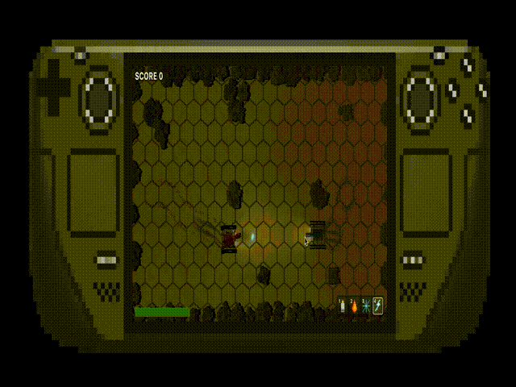

# exp_webgpu_tf

**▶ Live demo: https://astaroverov.github.io/exp_webgpu_tf/**
_(needs a WebGPU browser — Chrome/Edge desktop. Click once to enable sound.)_

A from-scratch browser game where you drive a tank against an opponent that was
**trained with reinforcement learning** — and everything (physics, GPU
rendering, and the neural-net training itself) runs **client-side in a single
tab, with no backend**. A personal hobby project to see how far the browser can
actually be pushed.

Three things built by hand, no engines or game frameworks:

- **My own ECS game engine** — ~50 components / ~40 systems on `bitecs`, with a
  2D Rapier physics backend. Strictly data-oriented: behavior is a _query over
  components_, never a branch inside a system. Runs headless and deterministic
  so it can be stepped as fast as possible for training.
- **My own WebGPU renderer** — hand-written WGSL + SDF shape passes and a
  screen-space **Radiance Cascades** global-illumination lighting pass. No
  Three.js/pixi.
- **From-scratch PPO** (Proximal Policy Optimization) on TensorFlow.js that
  actually trains the agent you fight.

## The game

A top-down desert combat prototype. Vehicles are composed from parts
bolted onto a compound Rapier body (hull, turret, wheels, tracks), so they take
**localized damage and shed debris** instead of being one rigid blob. Multiple
weapon families share a single damage pipeline: ballistic guns, rockets, an EMP
gun, and continuous **flame / frost streams** with damage-over-time and slow
effects — plus shields, repair, scoring, and destructible terrain.

## The training

A **distributed actor/learner RL pipeline running entirely across Web Workers**:
actors run the headless sim + inference on the WASM TF backend, learners train
on the WebGPU backend, and the main tab shows a live visualizer + metrics
dashboard. It uses action masking, an opponent population (self-play + frozen
past selves + scripted baselines), and a curriculum. **The same headless engine
serves both** the trainer and the playable game — the opponent in the demo is
one of these trained networks, run through the exact training inference path.

## Tech stack

TypeScript · Web Workers · WebGPU + WGSL (custom renderer) · `bitecs` (ECS) ·
`@dimforge/rapier2d` (physics) · TensorFlow.js (`webgpu` + `wasm`) · Web Audio.

## Status

Active personal experiment — APIs, package names, and the game itself change
freely as I explore. Shared as a record of what I'm tinkering with, not as a
product.
